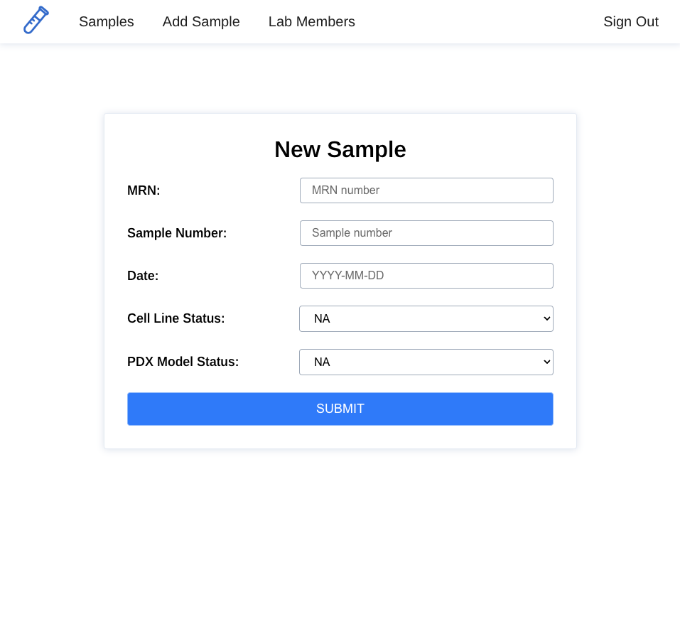

# Patient Sample Tracker

This app was inspired by my time working in a lung cancer translational research lab. The lab receives patient samples from the main hospital of which the lab is affiliated, and research technicians then work to develop these samples into cell lines and PDX models (mouse models) for use in the lab's research. 

This app functions as a tracker for these samples, allowing the user to track the patient MRN number, the sample number, the date of the sample, and the status of the cell line and PDX model. To gain access to the site, the user must sign up, and an administrator must authorize the account. Admins control admin and authorization status of users, and can also edit and delete any sample (authorized users can only edit or delete their own samples). 

The authorization system is meant to mimic a locked environment that only lab members can access, but it should be noted that it does not provide sufficient security, especially in the context of sensitive patient data, and this particular versionn should not be used as such. 

# [Visit the site here](https://patient-sample-tracker.netlify.app/)

[View back end repo here](https://github.com/DanielleColucci/patient-sample-tracker-back-end)

[View planning materials here](https://trello.com/b/V3dfXxeM/patient-sample-tracker)

---

## Technologies Used

 
 
 
 
 
 
 
 
 
 
 

## Ice Box

- [ ] Light/dark mode
- [ ] AAU I want to be able to search for a sample by the sample number
- [ ] AAU I want to be able to attach gene sequences to patient samples
- [ ] AAU I want to be able to translate gene sequences into amino acid sequences
- [ ] AAU I want to be able to update my profile photo 
- [ ] As an administrator, I want to be able to "archive" formerly authorized users to differentiate between new unauthorized users
- [ ] AAU I want to be able to update my profile photo 